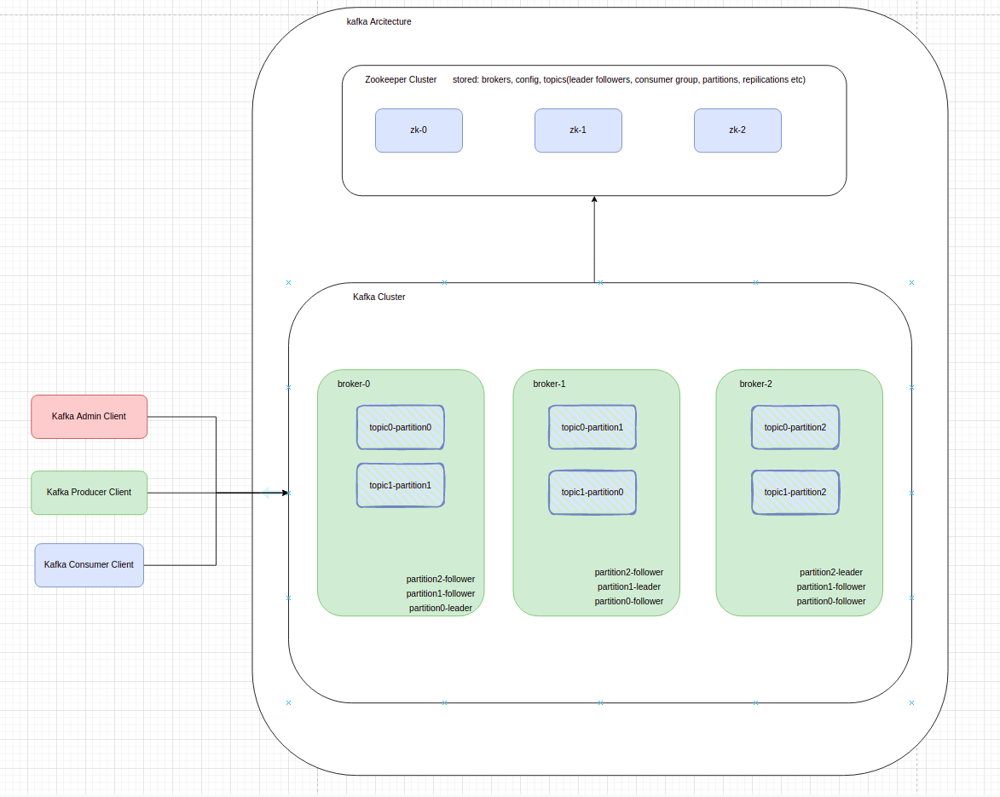

# Kafka Architecture
## 1. Kafka architecture summary

### 1.1 Partition
Cause of A topic logs size can be very huge (for example more than 50G), even a single computer can not handle it. Kafka allow a topic
logs separate to multiple partitions. Message will be separated to different partitions by message key. Different 
partition can be distributed in multiple brokers.

### 1.2 Message Ordering
Since messages separated to different partitions by message key, Message can only ordered by appending order according 
its key. Therefore, Kafka can not ensure messages in order which with same topic but different key.

### 1.3 Replication
Replication strategy is for disaster recovery and high availability for reading. A message can be replicated in different
brokers.