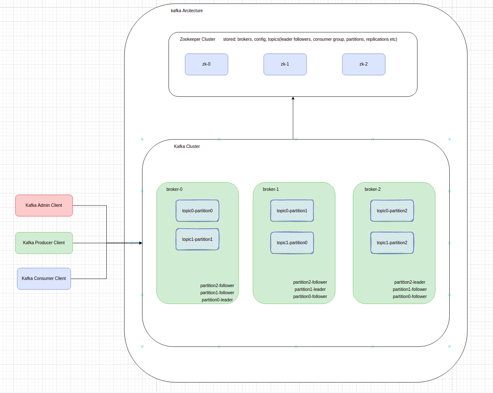
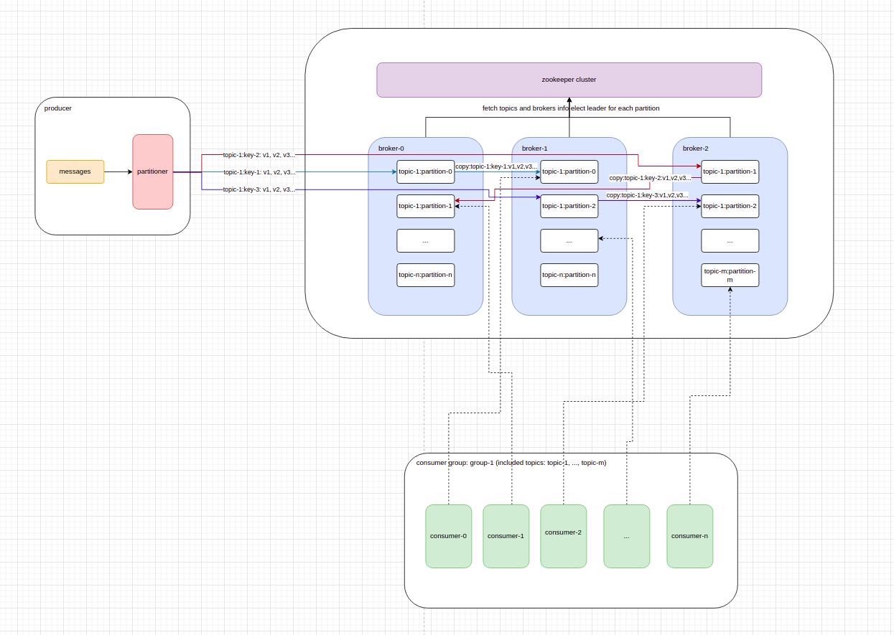

# Kafka Architecture
[To see kafka documentation](https://kafka.apache.org/documentation/)

## 1. Kafka architecture summary

## 2. Notes

### 2.1 Partition
Cause of A topic logs size can be very huge (for example more than 50G), even a single computer can not handle it. Kafka
allow a topic logs separate to multiple partitions. Message will be separated to different partitions by message key. 
Different partition can be distributed in multiple brokers.

### 2.2 Message Ordering
Since messages separated to different partitions by message key, Message can only ordered by appending order according 
its key. Therefore, Kafka can not ensure messages in order which with same topic but different key.

### 2.3 Replication
Replication strategy is for disaster recovery and high availability for reading. A message can be replicated in different
brokers.

### 2.4 Log Compaction
Since a single broker has limited storage capacity, Kafka allow to set log compaction strategy, setting named 
`log.cleanup.policy`. Kafka have a default value for this setting. We can set this value while creating a new topic,
optional value as [compact, delete]. As to compact policy, Kafka will tag expired log value to null according to 
timestamp, keep the latest log value, and then delete the null values.

